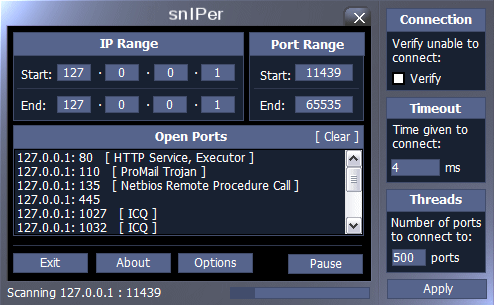



## \[snIPer\] A multiple port scanner

### Description

Unhappy as I was with other simple port scanners, I wrote snIPer. It'll scan a range of IPs as well as a range of ports, extremely fast with upto 999 simultaneous threads. I'm sure there are some bugs in the code, I wrote this about 3-4 years ago, found it again the other day and thought it might be worth uploading. Any comments, suggestions, critisms, death threats are more than welcome. Sorry, I haven't annotated it, if I get some free time I'll fix the bugs I find and give it comments. Just to explain WHY it’s faster, I have found and it runs faster than every scanner I’ve found yet except for SYN scanners. This is because it doesn’t don’t rely on winsock timing out, you set the timeout yourself (default of 4ms) and when the port has been open at that length of time the thread forcibly disconnects from the host without waiting for winsock to timeout and create an error report to provide the Visual Basic runtime files, which I’ve found effectively cuts time on an unnecessary function in the port scanner, there are buffer overflow issues when the scanner has more to do than Visual Basic will allow it, i.e. When 999 threads have scanned around 300,000 ports.

I think for my next project I’ll get onto writing a stealth scanner (SYN>SYN/ACK>CLOSE) with the same principle of response time as snIPer, fix the buffer overflow issue and add some extra functions to it. So watch this space! If anyone finds a faster SYN>SYN-ACK>ACK (Connecting) port scanner, let me know!!
 
### More Info
 

             |
---                |---
**Submitted On**   |2005-02-02 22:02:44
**By**             |[Luke Huxley](https://github.com/Planet-Source-Code/PSCIndex/blob/master/ByAuthor/luke-huxley.md)
**Level**          |Beginner
**User Rating**    |4.7 (70 globes from 15 users)
**Compatibility**  |VB 5\.0, VB 6\.0
**Category**       |[Internet/ HTML](https://github.com/Planet-Source-Code/PSCIndex/blob/master/ByCategory/internet-html__1-34.md)
**World**          |[Visual Basic](https://github.com/Planet-Source-Code/PSCIndex/blob/master/ByWorld/visual-basic.md)
**Archive File**   |[snIPer184741222005\.zip](https://github.com/Planet-Source-Code/luke-huxley-sniper-a-multiple-port-scanner__1-58653/archive/master.zip)

